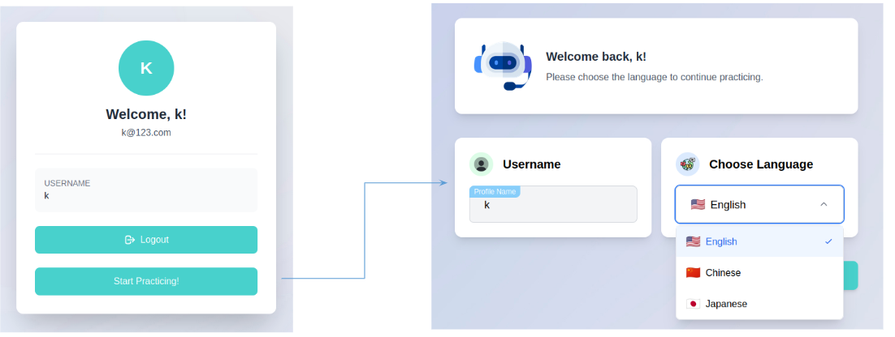
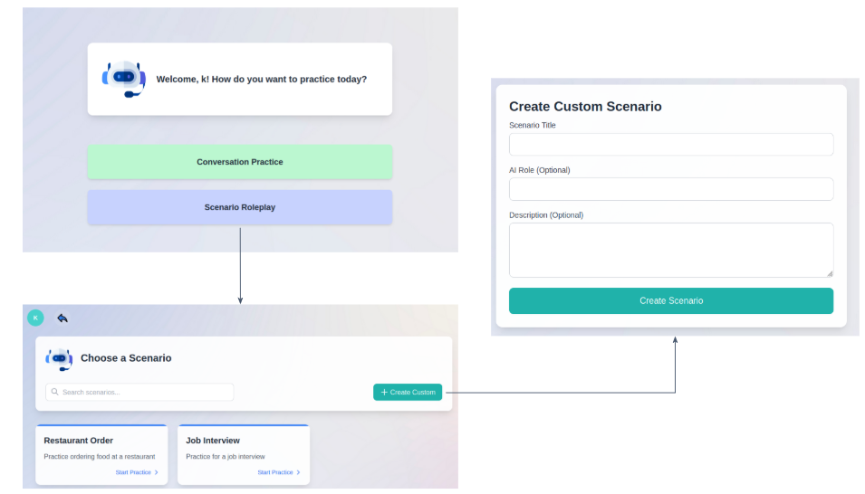
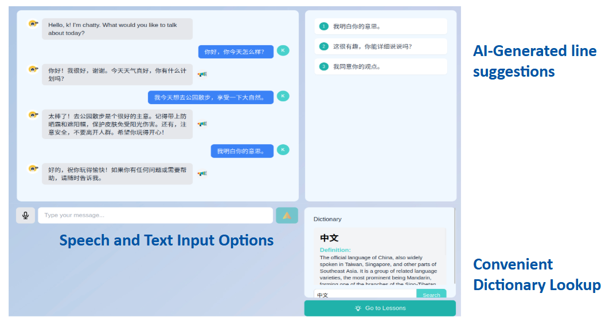
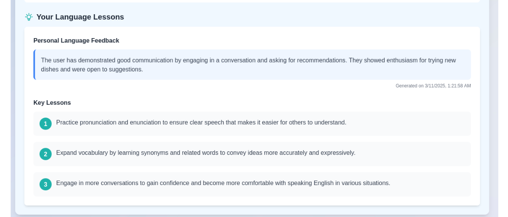
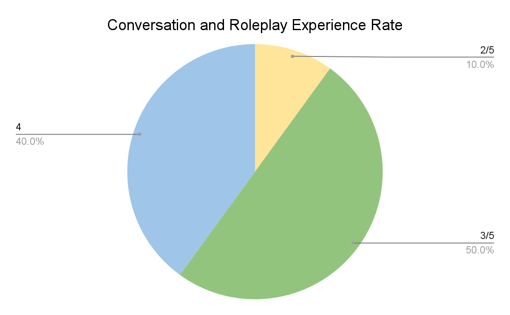
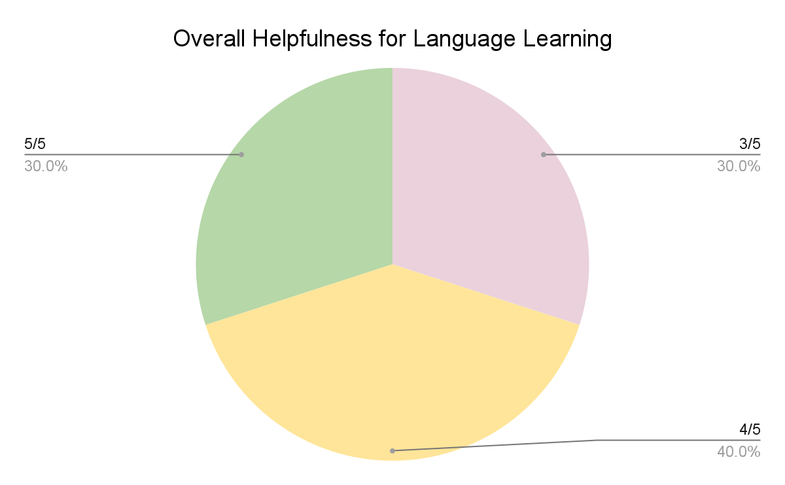

# Chatty: An All-in-One Language Learning System 

Daniel Kao, Hubert Tang, Wenhan Yang, Kaiwen Xue

# Introduction

When we were first deciding on ideas for our project, we knew that we
wanted to do something regarding language learning. Narrowing that idea
down, many of us recalled our own experiences in language learning, from
the various and confusing resources we could use like textbooks or apps
such as Duolingo to the challenge of finding time and opportunities to
practice. Thus, we decided to explore this avenue more as part of our
CS239 project, interviewing and surveying more people to completely
figure out what sorts of language learners there are, the challenges
they face, and ultimately, what sort of tools that can be used to
address these issues.

Ultimately, after several interviews and surveys, we realized that the
biggest challenge language learners faced is the lack of opportunities
to practice. Usually, it's simply due to a lack of having someone who
can speak that language to practice. Furthermore, the language learner's
own self consciousness about their language learning abilities also
sometimes gets in the way of finding opportunities for them to practice
as well.

With this knowledge about language learning challenges, we now have our
complete motivation for our project: a language learning system that can
give users ways to practice that is both convenient for them and also
welcoming, along with including several different features that can help
the whole process, such as a dictionary to look up words, ways to
continue a conversation, and also a way to review a user's performance
and see what methods they could improve on. Thus, our final system for
our CS239 Project, Chatty, was born.

**Problem Statement**

Based on both what we got from our interviews and surveys and from
additional feedback, we have two separate problem statements, based on
the two types of user personas that we got: heritage speakers, who grew
up in a different language-speaking household and are familiar with
speaking and listening modalities as a result, and non-heritage
speakers, who are learning a new language from scratch.

Heritage speakers:

Since heritage speakers typically grew up while interacting with other
language speakers, they typically are proficient in speaking and
listening in that specific language. Unfortunately, opportunities for
writing and reading typically don't come up as often, making these
modalities less proficient for them. This difficulty in writing and
reading becomes even more complicated with character-based languages
like Chinese and Japanese, whose characters can be hard to recognize.
Finally, as heritage speakers spend more time outside of their families,
such as in college or in high school, they tend to lose proficiency due
to time and lack of practice.

Non Heritage Speakers:

From our interviews and surveys with non-heritage speakers, we found
that many of them typically lacked opportunities to practice or engage
with the language they are learning. THey might have resources like
textbooks and apps such as Duolingo, but these only go so far to help
with the learning process, mostly focused on things such as vocabulary,
spelling and grammar. Many of them talked about wanting opportunities to
get authentic practice through talking with others who knew the
language, but typically aren't able to. What's more, without these
opportunities, their consistency for language learning will decrease and
they might even feel self-conscious about their language proficiency,
limiting further from seeking other opportunities. That said, many
speakers said that if there was a system that let them practice in an
engaging and encouraging way, they would feel more confident and willing
to continue their language learning.

**User Research**

Our user research consisted of two approaches: interviews and surveys,
which we collected through sending out friends, family members, and
classmates who have had language learning experiences. We used
interviews to get in-depth responses from users about their language
learning journey, challenges, tools used, and what sort of resources
they would have liked to have when they were learning languages.
Surveys, meanwhile, were meant to cast a broader net of responses from
potential users, with questions that were condensed versions of our
interview questions to capture broader trends regarding language
learning.

**Interviews**

During our user research, we conducted 10 interviews with various people
who had challenges while learning a second or a third language. These
sessions lasted between 30 to 60 minutes, and included questions that
discussed each interviewee's language learning journey, why they wanted
to learn the language, any tools (like textbooks or apps) that they used
and their thoughts on them, challenges they faced, and what sort of
tools they would like to help them learn a language. Collecting these
in-depth responses gave us valuable information about the challenges
language learning users had and what they wanted most out of the
learning tools they used.

**Surveys**

Surveys, on the other hand, contained a condensed version of our
interview questions, which was modified to be completed in around 10
minutes through structuring questions as 'check all boxes' style
questions or multiple choice responses. We designed our survey this way
to get a more general view of language learning and its challenges. With
around 35 surveys collected, we got to capture a diverse spectrum of
language learning strategies, tools used for different languages, and
challenges faced from our surveyees.

Based on our user research, we decided to move forward with the
following design goals:

**1. Motivate learning through a positive environment**

We wanted to motivate language learners by creating positive
conversational experiences with users. We aimed to achieve this with a
fun and interesting UI, as well as providing a friendly language
partner.

**2. Facilitate review to encourage learning**

We want to provide features to encourage learning, either through
constructive feedback or direct review. When our users end their
conversation, we want a way for them to think back towards their
experience and identify ways to improve.

# 

**System design and implementation:**

{width="6.5in" height="1.9305555555555556in"}

**Tech stack overview**

We have two major components within our system. The frontend contains
all the user facing components, supporting language input and output
between users and the large language models. The backend hosts the large
language models, as well as saves information about the user, such as
which language they want to learn.

**Front end**:

The front end is supported as a web application using Next.js to render
the web pages, and Node.js to execute any underlying operations. To
implement the aesthetic design choices, our system uses Tailwind CSS for
both flexible and easily configured styling.

When a user first interacts with our system, they are directed to a log
in/sign up page where they can enter their information for their
account. They also have the option of proceeding with a guest account if
they do not want to have their interactions saved within our system.

{width="6.5in" height="2.4583333333333335in"}

**Signing in with an account**

After the user signs up, they are directed to the home page of the app,
which introduces them to the two features available: conversational
practice, and scenario roleplay. The conversational practice page takes
the user directly to the interface with the LLM, while in the scenario
roleplay, the user has an intermediate page where they can choose
between scenarios, or enter their own.

{width="5.348958880139983in"
height="3.0602209098862643in"}

**Home page to scenario page flow**

**\
\
**

The conversational practice page and scenario page UI for the chat bot
is almost identical, as the distinction for the user experience is
introduced in the backend. For the conversational page, the topics are
free-flowing, while the scenario page allows the user to engage in
specific roles or discuss a certain topic.

{width="6.5in" height="3.4166666666666665in"}

**LLM interaction page**

The LLM interaction page contains three main components. The left side
of the page lets the user converse with the LLM, supporting text inputs
given the user's keyboard language settings, and speech inputs with
WebSpeechAPI. The right side of the page is aimed at supporting the
user's conversational experience. The top component contains AI
generated line suggestions based on the current conversation. The user
can click on these suggestions to automatically add them to the input
text box. The bottom component is a dictionary connected to Google's
Gemini API, where the user can look up any unknown words or terms and
get a quick overview with examples.

At any point, if the user is logged in, they are able to access their
profile, which shows their previous conversations as well as their
account information. Notably, the user profile also contains the lessons
page, which provides critiques to the user based on their past
conversation.

{width="6.5in" height="2.7777777777777777in"}

**Lessons Page**

With these pages, we have set up a user flow within our system to
encourage interactions and positively influence the learning experience.

**Backend**

Our system, Chatty, is designed as a modular language learning assistant
that enables immersive, friendly, and scenario-driven conversations with
an AI partner. The backend is built using FastAPI and integrates a large
language model (Orion-14B-Chat) that supports multiple languages,
including Chinese, Japanese, and English. Core features such as scenario
roleplay, target language enforcement, and conversational feedback are
implemented through careful prompt design, user state tracking, and
response handling. Below, we detail the major components of the system
from an implementation perspective.

In Chatty, each user has a persistent profile (stored as a JSON file)
that includes fields such as the selected scenario, the lessons the user
has completed, and the chat history between the user and Chatty. This
information is later used to provide personalized suggestions during
conversations, as well as personalized critiques and lessons after the
conversation.

Chatty enables rich, user-driven scenario roleplay by allowing learners
to define the context, tone, and character of their practice
conversations. When initiating a session, the user can input a scenario
description, a character description for Chatty, and an optional AI
role. If the AI role is not provided, Chatty uses the language model to
infer one. This is done by prompting the model with the scenario
description and asking it to generate a short, appropriate role label.
For example, if the scenario is \"I want to practice returning a broken
phone to an electronics store,\" the model might infer the role \"store
clerk.\"

In addition to supporting custom scenarios, Chatty includes several
predefined options, such as \"ordering at a restaurant\" or \"attending
a job interview.\" These come with fixed scenario text and associated AI
roles that are automatically used to guide the interaction.

At runtime, Chatty constructs a prompt for the language model that
incorporates the selected or inferred AI role, the scenario context, the
target language, and the recent chat history.

This prompt structure ensures that the model stays in character and
maintains language consistency, regardless of how the user writes their
messages. Even if the user inputs a mix of English and the target
language, the model is required to respond exclusively in the specified
language, reinforcing immersive practice. The phrasing \"Keep your
wording short, friendly, and simple\" is deliberately included to
encourage responses that are approachable and appropriate for learners.

By integrating flexible role assignment, scenario context, and
prompt-level behavioral constraints, this feature transforms each
session into a focused, dynamic roleplay experience tailored to the
user\'s learning goals.

To support comprehension during conversations, we integrated a
dictionary feature that uses Google's Gemini model. This allows users to
query specific words or phrases they don't understand during their
chats. The dictionary provides quick and relevant translations or
explanations, bridging the gap between immersive learning and accessible
support.

Chatty also includes a suggestion function to help users who may be
unsure how to continue the conversation. When the dialogue stalls, the
system generates three context-aware sentence suggestions that the user
might realistically say next. This is implemented by combining recent
chat history into a prompt and asking the LLM to continue the
conversation from the user's perspective. These suggestions are always
in the target language and serve as a way to boost learner confidence
and fluency.

For auditory reinforcement, all model responses are optionally converted
into spoken audio using Google Text-to-Speech (gTTS). The resulting
audio files are saved on the server and returned to the user via static
links. This helps learners develop listening and pronunciation skills in
tandem with reading and writing.

After a conversation, users can receive a personalized lesson plan and
critique generated from their chat history. We aggregate up to 15 recent
exchanges and feed them into the language model with a prompt asking it
to generate a short critique and three actionable lessons tailored to
the user's grammar, fluency, or phrasing. If errors are detected, they
are corrected with explanations; if not, the lessons focus on refinement
and stylistic improvement. This reflective learning loop gives users
insight into their progress and clear next steps.

# 

**Pilot User Sessions**

Firstly, we conducted five pilot user sessions to test the system.
During these sessions, users were free to explore different
functionalities while we recorded their interactions. Afterward, we
interviewed the participants and gathered their feedback to identify
areas for improvement. After the pilot user sessions, we added the
dictionary function and the prononciation function, as well as changed
the theme of our interface to make it look more natural and lively.

**Evaluation Questions**

With these enhancements in place, we proceeded with the official
evaluation, focusing on two key design goals: ensuring user-friendliness
and motivating users.

1\. How well can the model hold a conversation with the user/ How easy
is it for the user to start practicing?

2\. Does our program motivate users more to continue learning their
language?

**Evaluation Methods**

Similarly to the pilot user sessions, in the evaluation, we recruited 10
users, most of whom were friends or classmates and they also
participated in our user research. Our evaluators have various cultural
backgrounds and language learning experiences. Based on our two
personas, we also included both heritage and non-heritage speakers.

During each session, we first let the evaluators use the system and
explore the functions by themselves, and if they have any questions, we
will step in to explain the function and provide assistance. This
approach allowed us to assess whether the signifiers and buttons on the
interface were intuitive and easy to understand. Each user uses the
system for about 20 to 30 minutes to try all the functions, starting
from the main page, followed by the login and signup functions, and then
exploring the rest of the features. While the evaluator uses the system,
our group members record users\' interaction with each function.
Afterward, we conducted interviews to gather feedback on their user
experience and collect suggestions for future improvements.

For each evaluator, we first asked them to rate their experience with
the conversation and roleplay features, as well as to provide an overall
rating of Chatty's effectiveness for language learning. Next, we
conducted follow-up questions based on their recorded interactions,
aiming to understand why they used the system in certain ways and
whether any features were unclear. We also gathered feedback on which
features they found most useful and their suggestions for improvement.
Their responses varied depending on their language learning background
and proficiency, providing us with diverse perspectives.

**Evaluation Results and Analysis**

For the analysis, we created two pie charts to visualize user ratings
and categorized users based on their language proficiency to summarize
their feedback. Below are the pie charts illustrating evaluators'
ratings for both the conversation and roleplay experience and Chatty's
overall effectiveness.

{width="4.036458880139983in"
height="2.490022965879265in"}

{width="4.109375546806649in"
height="2.5156255468066493in"}

**Findings**

1\. Our language model can hold conversations with most users, but it
still struggles for longer conversations. When conversations are longer
than 5-10 responses, it becomes kind of repetitive and hard to drive the
conversation to a new topic. Users become distracted and try to break
the system through disruptive prompts because they are bored of the
repetitive AI responses.

2\. Additionally, users noted that suggestions vary depending on the
chosen language. Several participants mentioned that it would be more
helpful if suggestions were provided in both their native language and
the target language, allowing for easier comprehension and learning.

3\. Many people struggled with navigating the scenario practice, and
they requested more information on how to best use the feature. For
scenario roleplay, some of our users mentioned wanting more description
or context to help them along with the conversation. One example cited
is that in the restaurant scenario, the evaluator said it is better to
have a picture of a menu or description of the restaurant to the users
will be more helpful.

4\. The dictionary feature was one of the most popular features,
providing easy access to learning vocabulary provided a positive
learning experience for users. Evaluators mentioned that they could
immediately look up words they don't know using the dictionary, and so
the conversational practice was smoother when there are gaps in
knowledge.

5\. Based on the evaluators' language proficiency levels, we found that
beginners struggled with longer sentence conversations. Since the
dictionary function does not support direct translation of long
sentences, beginners often experienced frustration when trying to
construct responses due to their limited vocabulary. Additionally, some
dictionary translations were too technical---for example, when a user
entered "chicken," the system returned a species name instead of the
commonly used term. To enhance usability for beginners, it would be
beneficial to add basic language support features, such as
Japanese-Romaji or Chinese-Pinyin conversion, making it easier for
learners to engage with the system.

6\. Unlike beginners, who may need more support with basic
conversations, users with higher proficiency tend to focus more on the
quality of the conversation. While they also encountered challenges with
longer sentences, many mentioned that the AI-generated responses felt
overly "textbook-like," making interactions feel less natural. Some
evaluators suggested adding a feature that allows users to adjust the
response level, enabling them to modulate the depth and complexity of
replies based on their language proficiency level. Regarding Chatty's
persona, we designed it to be friendly and encouraging, and most users
responded positively, noting that the chatbot was non-judgmental and
supportive, and kept encouraging users to continue with the
conversation.

7\. Most users appreciated the lesson feature of our system but
suggested several improvements. Many expressed that they need more
immediate feedback on spelling and grammar mistakes rather than waiting
until the end of the conversation to review errors on the lessons page.
They felt that real-time corrections would help reinforce learning by
keeping suggestions fresh in their minds, making it easier to improve as
they practiced.

**Final Discussion**

One of our key takeaways from building and evaluating Chatty is how
powerful scenario-based roleplay can be for language learning,
especially when paired with a large language model that can adaptively
play different roles. However, we also discovered that immersion
requires more than just dialogue. Several of our evaluators commented on
the lack of visual or contextual cues in the current experience. For
example, in the "ordering food" scenario, users had to ask the AI what
was on the menu rather than being able to see one. Similarly, during
mock interviews, it would have helped to present users with a sample
resume or job description. These small environmental cues could
significantly increase realism and reduce cognitive load for learners.
Originally, we had brainstormed ideas like including a restaurant image,
menu options, or documents depending on the context, but we didn't
prioritize implementing them in the final system. In hindsight, this was
a missed opportunity, and one of our biggest areas for future
improvement.

Another major learning was around scoping. We started with ambitious
goals, including multimodal input, live audio transcription, and
multiple types of learner feedback. While some of these features made it
into the prototype, others were cut due to time and complexity
constraints. In the future, we plan to scope more tightly from the start
and validate early versions before adding more layers of complexity.
This would have helped us focus our efforts on polish and usability
rather than breadth.

From a usability perspective, we also noticed that some users were
uncertain about what to do, especially in custom scenarios. Even though
we had functionality for setting roles and describing situations, it
wasn't always obvious to users how to start the interaction or what kind
of inputs would lead to engaging conversations with our UI. This points
to a need for more intuitive onboarding and clearer UI design, possibly
with sample prompts or visual walkthroughs.

In summary, while we're proud of the system we built. We believe the
next version of Chatty could benefit from more immersive visual
elements, tighter scope, and improved affordances for first-time users.
These lessons will shape how we continue to develop this tool beyond the
classroom setting.

# 
